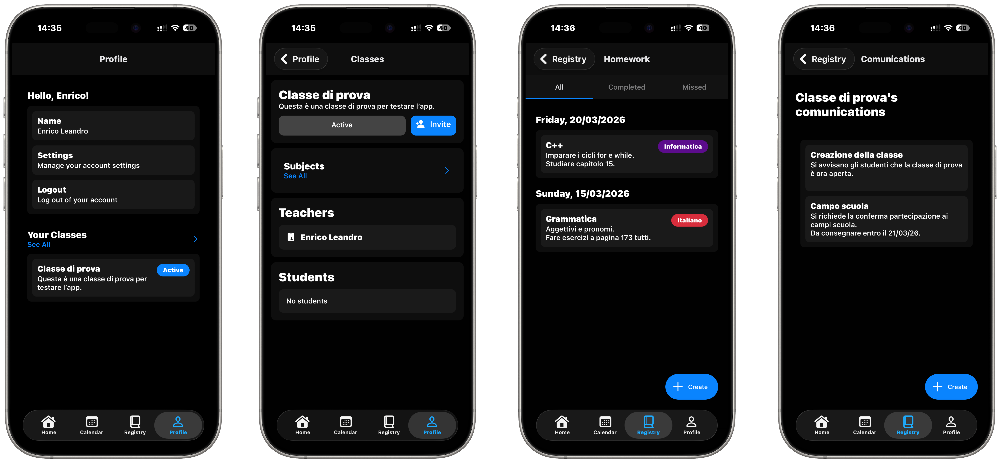

# 🎓 School Manager


Welcome to the school manager repo!

School Manager is a cross-platform app designed by a student to help you manage your school life better!

Its goal is to facilitate finding homework, lessons, and planning your study sessions, for both students and teachers.

# 📷 Screenshots


# 🪄 How it works
This is an Expo 55 React Native app, built for mobile and web.

School Manager uses Tauri to bundle the web version of the app into a desktop environment app.

The web version is currently experimental and may contain glitches.

# 🧱 Architecture
The project is divided into two main components:
### ./app/
React Native Expo application (mobile, web, desktop UI)
### ./server/
Node.js API server handling authentication, database access, and email OTP verification

# 🚀 Usage
> ⚠️ The app's database __WILL BE CLEARED__ once the server is 100% complete and tested. Currently, many routes aren't fully complete and may have issues. This is a safety measure for data safety.

You may test the latest release of the app through [this site](https://schoolmanager.expo.app/), or you can decide to build the app yourself with the instructions listed below, to install on your personal device.

The app is planned to be posted on app stores, once a first complete build is ready.

If you are building and running locally, you can start the app with:
```js
cd ./app/ && npx expo start
```
Remember to also start the development server on a separate terminal with:
```js
cd ./server/ && node .
```

# ⚙️ Features
> ⚠️ An account required for creating and joining classes
* Create multiple classes
* Invite users to your class, or teachers to help manage lessons and homework
* Create multiple subjects for more specific organization of the class
* Add homework and lessons to a specific subject, or communications to the whole class.
* Sync your account's data between devices with passwordless accounts (receive an OTP code via email)

# 📋 Roadmap
<details>
<summary>✔️ Completed</summary>

* ✔️ React native app project and layouts
* ✔️ Database models
* ✔️ Setup page
* ✔️ Base app components (alerts, lists, etc.)
* ✔️ User account (OTP, automatically managed signup/login, data sync)
* ✔️ Classes
* ✔️ Class invites
* ✔️ Subject creation
* ✔️ Lesson creation + adding to subject
* ✔️ Communication creation + adding to subject
* ✔️ Homework creation + adding to subject
* ✔️ First app optimization review (fix all warnings and optimize views)
* ✔️ Calendar page
* ✔️ Setting for language switching
* ✔️ Setting for notification handling
* ✔️ Server updates for other components
* ✔️ Revise server code, check permissions (minor milestone)
* ✔️ Tomorrow page
* ✔️ App themes!
* ✔️ Custom app icons!
* ✔️ App lock
* ✔️ Confirmations for communications (accept, deny, message)
* ✔️ Week schedule
* ✔️ (Teacher) List comunication responses
* ✔️ File upload support (toggle in server .env)

</details>

<details open>
<summary>⚙️ In progress</summary>

* ⚙️ Resources (links to websites or files)
* ⚙️ Scheduled exams (important milestone)
    * Also add specific users only scheduled exams (Special Educational Needs (SEN) / Disturbi Specifici Apprendimento (DSA))
* 🛠️ (Heavy work, will stay here for a while) Offline app usage

</details>

<details>
<summary>✧ Future</summary>

* ✧ Local unsynced class (for not logged in users)
* ✧ Add logout logic (invalid user token)
* ✧ User grades
    * Find required grade (or grade pair) to reach a goal.
* ✧ Second app optimization review (fix all warnings and optimize views)
    * While reviewing, add custom themes & custom app icon
* ✧ Request switching account to teacher in-app
* ✧ In-app feedback and feature requests page
* ✧ App animations (for alerts and custom made components)
* ✧ System calendar integration
* ✧ Get platform licenses (important milestone, publish to testflight and distribute beta apks)
* ✧ Push notifications
* ✧ Account token revocation
* ✧ Search tab (crawl through the whole app data locally)
* ✧ Local LLM integration with search tab 
    * No results: find potential matches with LLM
    * Found results: generate related content
    * Manage study sessions + record progress
    * Homework generator (exercises on topic -> pdf output) -> Include guided exercises, scaling to more difficult exercises.
    * Topic summary from uploaded resources
    * Summarize arguments where user is less prepared (based on grades)
* ✧ File Uploads (client side)
* ✧ Page filters (filter homework/lessons/... by subject, date, etc)
* ✧ Custom database hosting (huge milestone, manage your own servers through desktop tauri app, integrate with main app with server code)
    * Add hashing, trust certificates, client challenges, and as many security measures as possible to prevent server tampering.
* ✧ Add own homework & exams (for class & subject, save in user data). NOT GRADES!
* ✧ Parent accounts
* ✧ Create schools
    * Check school's institutional email address with OTP code (only one user per email for maximum security)
    * Use QR verification to check if a user is actually from the school (1 minute validity)
    * School events page
    * Documents & modules (for school purposes)
    * Admin Dashboard
* ✧ Presence register
* ✧ App Admin Dashboard
    * Find users, schools, classes (can't read data)
    * Disable user accounts, delete schools, classes.
* ✧ In-app class/school feed + DM chats
* ✧ App home screen quick actions (hold app icon)

</details>

<details>
<summary>? Ideas</summary>

* ? Integrate with personal assistant (Siri/Gemini/...) (Not supported with standard Expo)
* ? Bridgefy / BLE integration for mesh network (upload and receive encrypted packets hotspot-like)

</details>

# 💾 Data Usage
School Manager does not share any user data outside of the app.

App data is hosted with MongoDB Atlas, and as of right now, the actual API endpoint is hosted on Render, using Resend for mailing.
App data is currently not encrypted. Avoid storing sensitive information.

Accounts do not use passwords. The sole verification method is OTP codes, effectively dropping account security management to your mailing service.

I do not take responsibility for DB data leaks;

If you're going to host your own server, it is up to you to ensure updating the server to the latest version. If a data leak occurs because of an outdated server, the responsibility falls upon yourself.

# 🛠️ Building
You can build the web and mobile versions of the app with expo.

If you want to build the tauri app, you will need the rust framework installed, and install the cargo-tauri package.

## 📖 Requirements
* NodeJS and NPM (tested with Node v24.14, NPM v11.9)
* To build for desktop, check out [Tauri's prerequisites](https://v2.tauri.app/start/prerequisites/)
* To build for mobile locally, check out [Expo's prerequisites](https://docs.expo.dev/guides/local-app-overview/#prerequisites).
    * For iOS you will need X-Code with the iOS runtime.
    * For Android you will need Android Studio with SDK 35.
* To build for web, you don't need anything extra. Hooray!

> ⚙️ Remember to run `npm i` on both the `/app/` directories and the `/server/` directories.

### 🔐 .env file
> ⚠️ When running locally, remember to define the environment variables for your MongoDB, and nodemailer/resend transports.
> It is recommended to use resend instead of the local icloud transporter.

Required fields:
```env
BRANCH=test
PORT=3000

MONGODB_URI="mongodb+srv://..."
JWT_SECRET="******************************"
RESEND_API_KEY=******************************

EMAIL_SEND_MODE=resend
ICLOUD_NODEMAILER_USER=user@icloud.com
```

## 🌎 Web
After installing Node, NPM, and run `npm i`, you can build for web with this command:
```sh
cd ./app/ && npx expo export --platform web
```
You will find the output files in the `./app/dist/` folder.

## 🖥️ Desktop
After installing Node, NPM, cargo-tauri, and run `npm i`, you can build the app with:
```sh
cd ./app/ && npm run desktop
```
You will find the output files in the `./app/src-tauri/target/` folder.

## 📱 Android & iOS
After installing Node, NPM and required SDKs, you can build a development build with:
```sh
cd ./app/ && npx expo run <platform>
```
This will launch the simulator with a development build.

If you have `eas-cli` installed (`npm i -g eas-cli`), you can also build locally with:
```sh
cd ./app/ && eas build --platform <platform> --local
```
* Valid platforms are `ios` and `android`.
* Remove the `--local` flag to build on EAS Cloud.
> ⚠️ You will need a MacOS device to build locally for iOS.

# 🤝 Contributing
Contributions are welcome.

Before submitting a pull request:
* Test your changes locally  
* Describe the changes clearly  
* Avoid submitting large unreviewed changes  
Pull requests that significantly change behavior should be discussed in an issue first.

# ✉️ Contacts
You can contact me at this email address, for questions, feedback, or any other matter.

**xarber@xcenter.it**

# 📄 License
This project is licensed under the MIT License.
See the LICENSE file for details.